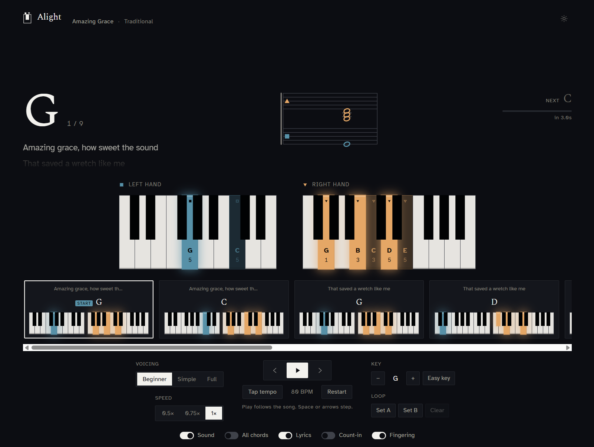
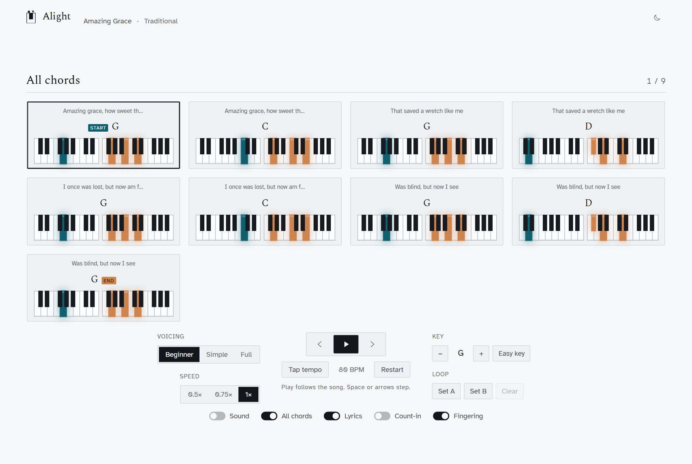
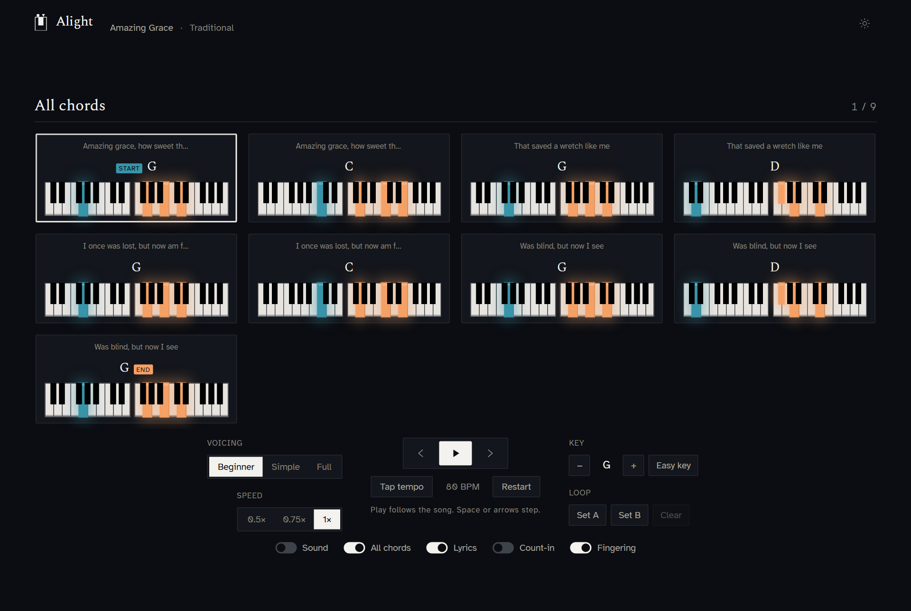
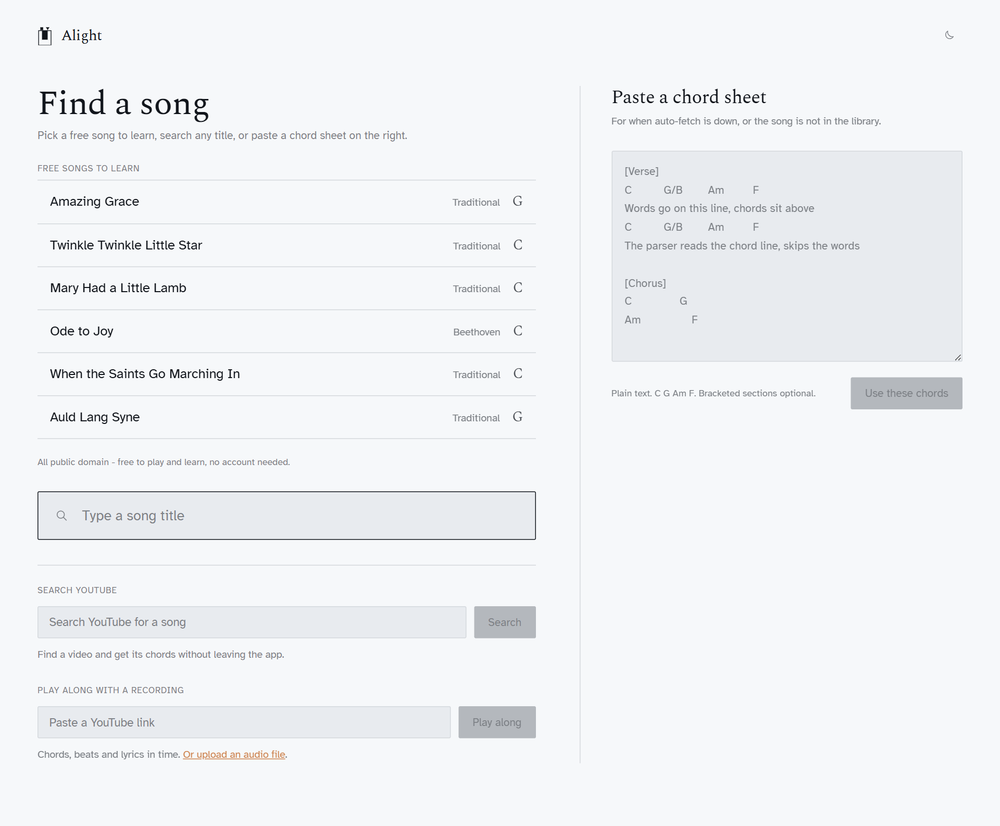
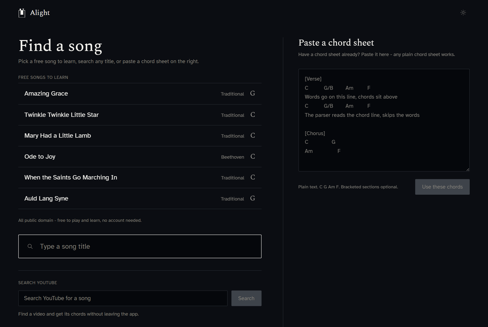

<h1 align="center">🎹 Alight</h1>

<p align="center"><strong>See exactly which piano keys to press - one chord at a time.</strong></p>

<p align="center">
  
</p>

Alight turns a song into two glowing mini-keyboards - one for each hand - that light up the
precise keys for every chord. No need to read a note, no theory homework. Sit down, look at the
screen, and play the song that's already in your head.

**Live:** <https://alight-rho.vercel.app> (gated - ask Macdara for the password)

---

## Why it's lovely to play with

- 🎹 **What you see is what you press.** The lit keys are exactly the keys - left-hand bass on one
  keyboard, right-hand chord on the other, with note names, finger numbers, and a shape marker so
  the hands never get mixed up. The chord you're on *glows*.
- 🎼 **Read it on the staff, too.** A little grand staff above the keyboards shows the chord's exact
  notes on treble and bass clefs - the same notes the keys light - so notation reading comes for free.
- 🔊 **Hear every chord.** Flip on Sound for a sampled grand piano: each chord plays as you move
  through the song, and you can tap any key to hear just that note.
- 🎤 **Words, in time.** Lyrics scroll line-by-line under the chord name and along the strip - now on
  the built-in songs, not only analysed recordings.
- 🌱 **Beginner-first.** A "Beginner" voicing simplifies every chord to a friendly triad, one tap
  finds the easiest key, and a calm "you played it through" greets you at the finish.
- 🎧 **Play along to the real recording.** Paste a YouTube link and Alight pulls the chords, beats,
  and synced lyrics - then plays the song while the keyboards follow it in time. Slow it to 0.75x
  for practice (the pitch stays put) and loop the tricky bar.
- 📚 **96 public-domain songs built in.** Nursery rhymes, folk tunes, sea shanties, spirituals,
  carols, rounds, and classical themes (Bach, Mozart, Beethoven, Grieg, Satie, Tchaikovsky and more) -
  most with singable lyrics, all instant, nothing to break.
- 🌗 **Light and dark.** A calm "showroom" look by day, glowing keys by night.

## A look around

**All chords at a glance** - flip to a grid of every chord in the song, lyric line and all, so you
can see the whole shape before you play it.

| Light | Dark |
| :---: | :---: |
|  |  |

**Find a song** - a public-domain library, title search, and in-app YouTube search with a live
preview, all in one place.

| Light | Dark |
| :---: | :---: |
|  |  |

## Two ways to start a song

- **By title.** Type a song name and Alight fetches the chords, picks the best version, and plays
  you through. Capo songs are transposed to true piano pitch automatically.
- **Play along with a recording.** Paste a YouTube link (or upload an audio file). The self-hosted
  ChordMini backend listens to the track and returns chords + beats + synced lyrics, and the Play
  view moves in time with the music - with the recording playing right alongside.

## Run it locally

```bash
npm install
npm run dev           # Vite dev server at http://localhost:5173 (UI only)
vercel dev            # full app, including the /api proxies
npm run build         # type-checks (tsc -b, strict) and builds to dist/
npm test              # parser + timeline tests (Node's built-in runner)
npm run typecheck:api # type-checks the serverless functions
```

`npm run dev` serves the UI on its own; the title-search and play-along paths need their serverless
functions, so use `vercel dev` to exercise them. The gate password defaults to `alight2026` and
lives in [src/gate.ts](src/gate.ts) (override with `VITE_ALIGHT_PASSWORD` for the client and
`ALIGHT_PASSWORD` for the functions).

## How it works (the fun part)

The heart of Alight is the **voicing engine** ([src/music/voicing.ts](src/music/voicing.ts)). Give
it a chord symbol and it works out the left-hand bass, the right-hand chord tones, and the inversion
label - then places the right hand so it barely moves from chord to chord. What the keyboards light
is exactly what the engine produces. No faked keys. Chord parsing rides on
[`tonal`](https://github.com/tonaljs/tonal).

For play-along, the **timeline** ([src/music/timeline.ts](src/music/timeline.ts)) is the bridge:
`fromChordMini()` maps the backend's chords + beats + lyrics into one shared shape, and a small
`requestAnimationFrame` clock (or the real audio element, when a recording is loaded) drives the
animation.

<details>
<summary><strong>The stack behind the YouTube button</strong></summary>

YouTube no longer serves real audio to datacentre IPs, so the "paste a link" path takes a scenic route:

```
Browser  ->  Vercel /api/analyze  ->  ChordMini backend (VPS)  ->  yt-dlp ->
                                                                       |
                                                                   SOCKS5
                                                                       v
                                                            Perth workstation
                                                            (residential IP)
                                                                       v
                                                                    YouTube
```

1. The client POSTs `{ youtubeUrl }` (or an uploaded audio file) with the gate header to `/api/analyze`.
2. The Vercel function forwards to the self-hosted ChordMini backend on the VPS, behind a bearer token at nginx.
3. ChordMini runs `yt-dlp` through a SOCKS proxy.
4. That proxy is an SSH reverse-tunnel from a home workstation, so yt-dlp egresses through a residential IP - the only way YouTube hands over real audio formats.

If the tunnel is down, the upload path still works. Details and the diagnosis playbook live in
[docs/play-along/yt-tunnel.md](docs/play-along/yt-tunnel.md).
</details>

<details>
<summary><strong>Repository layout</strong></summary>

| Path | Purpose |
| --- | --- |
| `src/` | React + Vite app (Play view, Load view, voicing engine) |
| `api/` | Vercel serverless functions (Ultimate Guitar proxy, ChordMini proxy, YouTube search) |
| `deploy/chordmini/` | Lean CPU-only ChordMini Docker build + run script |
| `deploy/perth-tunnel/` | The residential SSH tunnel wrapper + install README |
| `design/` | Tokenised design system (colours, typography, piano, play) |
| `docs/` | Product brief, project plan, play-along architecture |

</details>

## What's next

Phase 1 (hear the recording while the chords follow it) is live. Next up: a **saved songbook** that
keeps your analysed songs - chords, timing, and audio - on the VPS so you can reopen and replay them
later. See [docs/PROJECT-PLAN.md](docs/PROJECT-PLAN.md) for the full roadmap.

## Design

The visual system of record lives in [design/](design/). The look is "Luxury Quiet" - a cool
showroom white, Spectral for display, Atkinson Hyperlegible for text - with the two hands always
distinguished by colour *and* shape so it stays readable for everyone.
